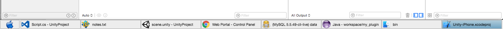

This project offers robust window management for macOS.

## Installation
* Download the latest release of `Taskbar` from [Github](https://github.com/nicolasjinchereau/taskbar-mac/releases)
* Alternatively, rebuild the XCode project in `/source` (optional)
* Drag `Taskbar.app` into the `/Applications` folder
* Run `Taskbar.app` and add it to allowed apps in the `Security/Accessibility/Privacy` preferences.

## A typical day at the office

